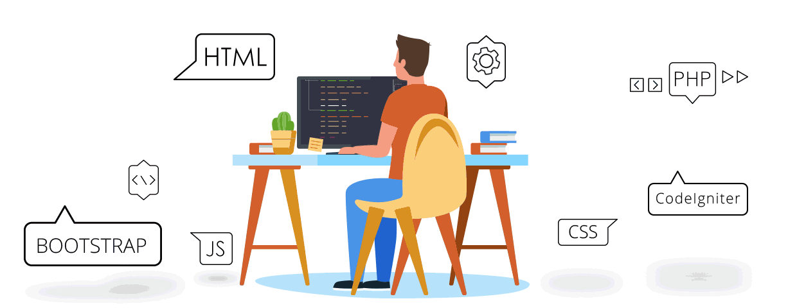

<h1 align="center">Hi 👋, I'm Vikrant</h1>
<h3 align="center">A frontend developer from India</h3>

  

  

- 🔭 I’m currently working on **Ai Voice Assistant**

- 🌱 I’m currently learning **Mern Stack Development**

- 💬 Ask me about **Web Devlopment,Python**

- 📫 How to reach me **vikranteditz26@gmail.com**

- ⚡ Fact **Introduction to generative AI Studio**

<h3 align="left">Connect with me:</h3>

<h3 align="left">Languages and Tools:</h3>

          

<h3 align="left">Support:</h3>

  

